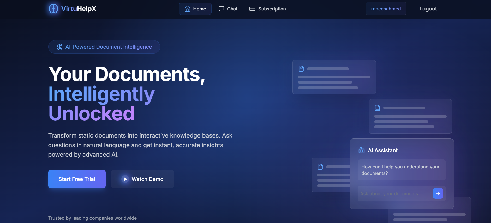

# VirtuHelpX - AI-Powered Document Intelligence Platform



VirtuHelpX is a sophisticated AI-powered document interaction platform that enables users to upload, analyze, and interact with documents through an intelligent chat interface. Built with modern technologies and best practices, it offers a subscription-based model with various tiers to suit different needs.

## 🌟 Features

- 🤖 **AI-Powered Chat Interface**: Interact with documents using natural language
- 📄 **Document Management**: Upload and manage various document types
- 💬 **Intelligent Q&A**: Get instant answers from your documents
- 🔒 **Secure Authentication**: Robust user authentication system
- 💳 **Subscription Plans**: Flexible pricing tiers with different features
- 📱 **Responsive Design**: Works seamlessly on all devices
- 🔄 **Real-time Updates**: Instant responses and updates
- 🎨 **Modern UI**: Beautiful and intuitive user interface

## 🚀 Tech Stack

- **Frontend**:

  - Next.js 14 (App Router)
  - TypeScript
  - Tailwind CSS
  - shadcn/ui Components
  - React Markdown

- **Backend**:

  - Next.js API Routes
  - Prisma ORM
  - PostgreSQL
  - OpenAI API

- **Authentication & Payments**:
  - NextAuth.js
  - PayPal Integration
  - JWT Tokens

## 📋 Prerequisites

Before you begin, ensure you have the following installed:

- Node.js (v18.17 or higher)
- npm or yarn
- PostgreSQL
- Git

## 🛠️ Installation

1. **Clone the repository**

   ```bash
   git clone https://github.com/RaheesAhmed/virtuhelp-x.git
   cd virtuhelp-x
   ```

2. **Install dependencies**

   ```bash
   npm install
   # or
   yarn install
   ```

3. **Set up environment variables**
   Create a `.env` file in the root directory with the following variables:

```
#JWT SECRET
JWT_SECRET=


#NEXTAUTH
NEXTAUTH_SECRET=
#Next Auth URL
NEXTAUTH_URL=http://localhost:3000

#Clerk
NEXT_PUBLIC_CLERK_PUBLISHABLE_KEY=
CLERK_SECRET_KEY=
NEXT_PUBLIC_CLERK_SIGN_IN_URL=/sign-in
NEXT_PUBLIC_CLERK_SIGN_UP_URL=/sign-up
NEXT_PUBLIC_CLERK_AFTER_SIGN_IN_URL=/chat
NEXT_PUBLIC_CLERK_AFTER_SIGN_UP_URL=/verify-email
NEXT_REDIRECT_URL=/chat

#OpenAI
OPENAI_API_KEY=
OPENAI_ASSISTANT_ID=
OPENAI_VECTOR_STORE_ID=

#Debug
DEBUG="prisma:\*"

#Database
DATABASE_URL=

DIRECT_URL=

DEBUG="prisma:\*"

#Paypal
NEXT_PUBLIC_PAYPAL_CLIENT_ID=

PAYPAL_CLIENT_ID=
PAYPAL_SECRET_KEY=

#PayPal Plan IDs
NEXT_PUBLIC_PAYPAL_BASIC_PLAN_ID=
NEXT_PUBLIC_PAYPAL_PREMIUM_PLAN_ID=
NEXT_PUBLIC_PAYPAL_ENTERPRISE_PLAN_ID=

```

4. **Set up the database**

```bash
npx prisma generate
npx prisma db push
```

5. **Run the development server**

   ```bash
   npm run dev
   # or
   yarn dev
   ```

6. **Open your browser**
   Navigate to `http://localhost:3000`

## 💎 Subscription Plans

### Free Plan ($0/month)

- 3 preloaded documents
- 3 self-uploaded documents
- Unlimited questions
- Basic summaries

### Starter Plan ($9.99/month)

- 5 preloaded documents
- 7 self-uploaded documents
- Advanced summaries
- Email support

### Pro Plan ($29.99/month)

- 20 documents
- AI-powered insights
- Cloud storage integrations
- Priority support

### Enterprise Plan ($59.99/month)

- Unlimited documents
- Team collaboration
- Custom branding
- API access

## 🔧 Usage

1. **Sign Up/Login**

   - Create an account or login
   - Choose your subscription plan

2. **Upload Documents**

   - Click the upload button in the dashboard
   - Select documents (supported formats: PDF, DOCX, TXT)
   - Wait for processing

3. **Chat Interface**

   - Navigate to the chat section
   - Ask questions about your documents
   - Get AI-powered responses

4. **Manage Subscription**
   - Access subscription settings
   - Upgrade/downgrade plan
   - View usage statistics

## 📚 API Documentation

API documentation is available at [API.md](API.md) when running the development server.

## 🤝 Contributing

1. Fork the repository
2. Create your feature branch (`git checkout -b feature/AmazingFeature`)
3. Commit your changes (`git commit -m 'Add some AmazingFeature'`)
4. Push to the branch (`git push origin feature/AmazingFeature`)
5. Open a Pull Request

## 📝 License

This project is licensed under the MIT License - see the [LICENSE](LICENSE) file for details.

## 🌟 Acknowledgments

- OpenAI for their powerful API
- The Next.js team for the amazing framework

---
